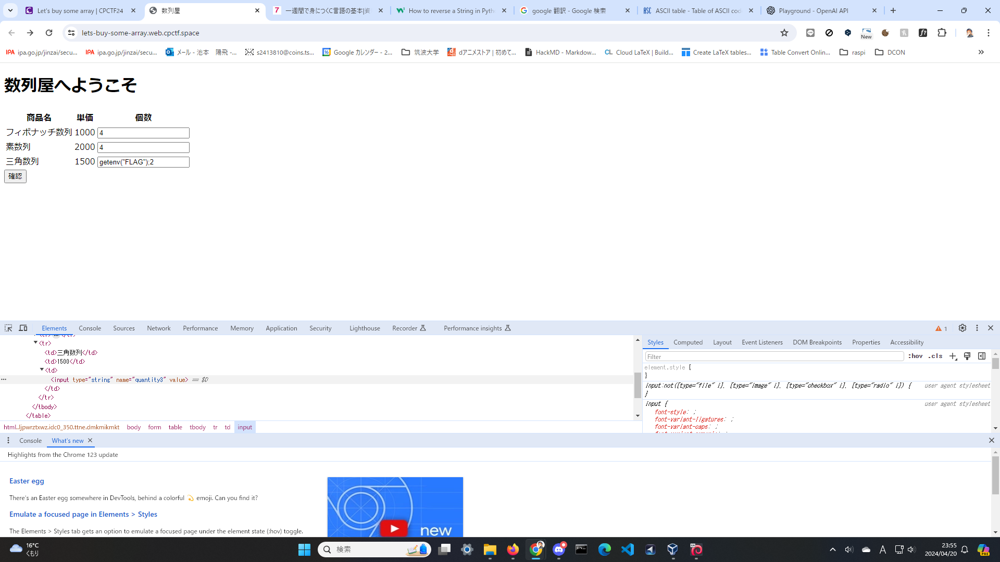
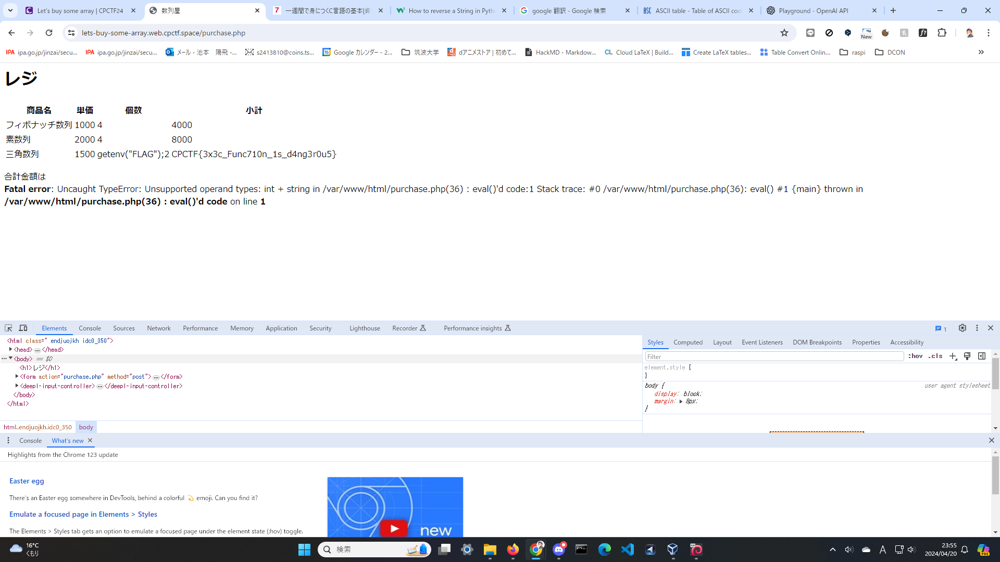

# lets buy some array
```
<td>三角数列</td>
                    <td>1500</td>
                    <td><?=$_POST["quantity3"]?></td>
                    <td><?=eval('return ' . $_POST["quantity3"] . '*1500;')?></td>
```

evalは任意コードが実行できる

FLAGは環境変数にあるからgetenvでとってくる

